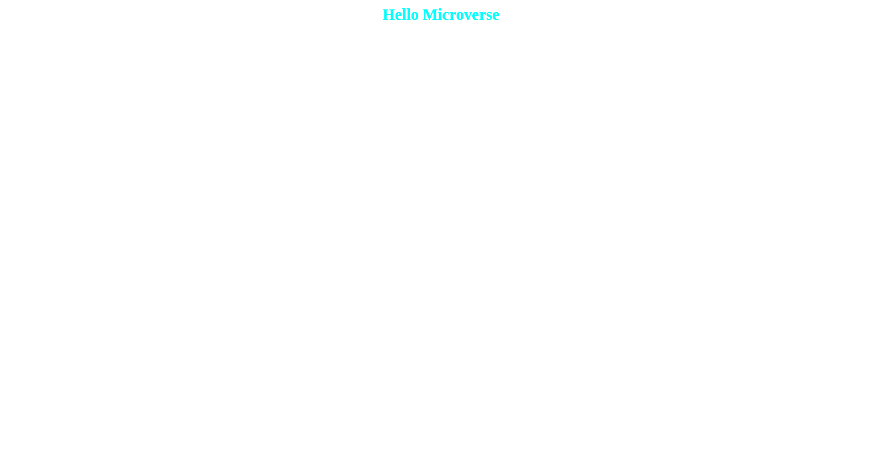

# Setup Linters

> Learning to setup  linters on Microverse bootcamp module 1 week 1

Additional description about the project and its features.

[Live Demo Link](https://livedemo.com)

## Getting Started

**This is an example of how you may give instructions on setting up your project locally.**
**Modify this file to match your project, remove sections that don't apply. For example: delete the testing section if the currect project doesn't require testing.**

## Authors

👤 **Author1**

- GitHub: [@Obote](https://github.com/Obote)
- Twitter: [@Obote_denis](https://twitter.com/Obote_denis)
- LinkedIn: [obote-denis-9859a2a3/](https://www.linkedin.com/in/obote-denis-9859a2a3/)

## 🤝 Contributing

Contributions, issues, and feature requests are welcome!

Feel free to check the [issues page](../../issues/).

## Show your support

Give a ⭐️ if you like this project!

## Acknowledgments

- Hat tip to anyone whose code was used
- Inspiration
- etc

## 📝 License

This project is [MIT](./MIT.md) licensed.
